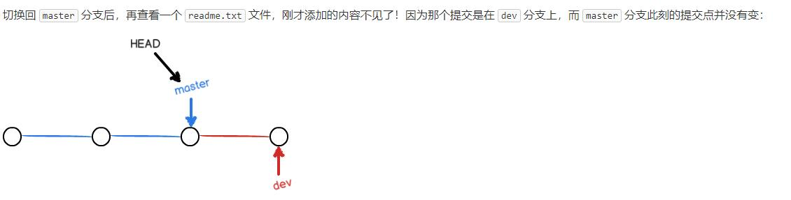
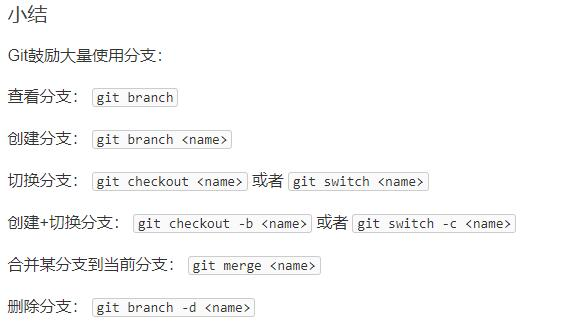
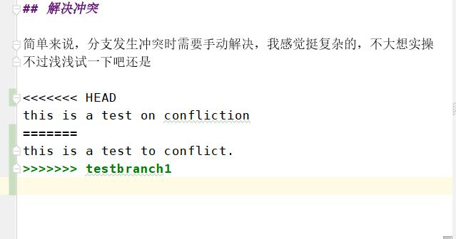
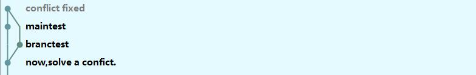
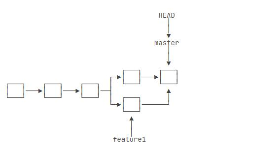

# gittest
a demo to practice how to use git

## trying to update something

one more try!

now i'm back in branch main

基本操作是这样的：

    "git add 文件名(. 表示add所有文件)"
    
    "git commit -m "a message to verify your commit."" #先add后提交
    
    "git log"#查看提交版本的历史记录，id号可用于回退历史版本
    
    "git reset --hard HEAD^"#表示回退上一版本（~num表示回退num个版本，也可以输入id，回退到指定版本）
    
    "git reflog"#用于记录每一次的命令，暂时没用到

小结附上一张图（摘自liaoxuefeng官网）：

## 工作区和暂存区
先附上一张图

    "git status"#查看当前状态

所以add用于将所有修改放到暂存区，commit用于将这些修改提交到分支，push就是上远程了

提交后没做修改再看status那工作区就是干净的

## 管理修改

**一句话核心：Git管理的是修改，而不是文件本身**

要记录修改的话一定要add暂存，暂存后才能提交

## 撤销修改

尝试换个颜色

    git checkout -- filename#丢弃工作区的修改
    
我理解是不管提交与否，实际上就是回到了上一次commit或提交的状态

记住 -- 参数很重要，没有 -- ，checkout就是切换分支的命令

    git reset HEAD filename#可以撤销暂存区的修改（已经add但未commit），重新放回工作区
    
小结附图：

先分割一下

---

## 删除文件

如果先add了一个文件，并且已经commit提交，但是在工作区将它删除以后
工作区和版本库就不一致了
这时 git status会告诉你哪些文件被删除了

此时有两个选择

1.确实要删除

    git rm
    git commit
    #先主动删除以后，再使用git add和git rm效果是一样的，因为记录的是修改
    
2.删错了需要恢复

    git checkout -- filename
    #其实就是用版本库里的文件替换工作区的版本
    
# 远程仓库
这个不说了，有点玄乎，大概就是怎么连接，要记录公钥，什么什么的
然后就是 push clone这些操作
其实还行

## 分支管理

    git branch#列出当前所有的分支
    git checkout branchname#切换到分支 名字前面加个-b 就是创建并切换
    

在这种情况下，切换回master，再

    git merge dev#相当于就把master切到了dev，更新了
    
这样之后，就可以删除dev了

    bit branch -d dev
    
反正我大概懂了，就是不确定你接下来的修改能不能直接用
所以创了个副本，如果有用就回去然后merge进来，没用就算了

小结一下吧

    
## 解决冲突

简单来说，分支发生冲突时需要手动解决，我感觉挺复杂的，不大想实操
不过浅浅试一下吧还是

测试完了，大概就变成了这种情况

## 分支管理策略