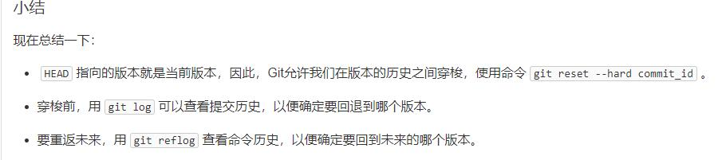
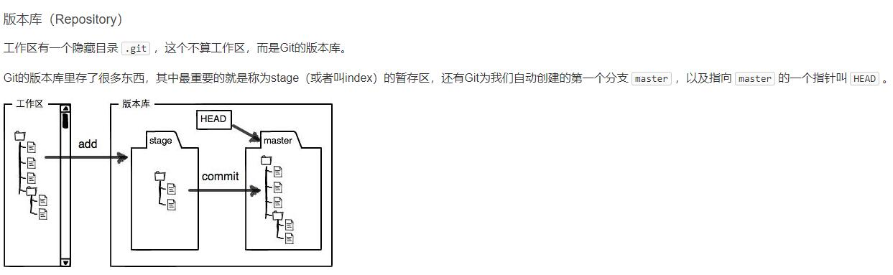
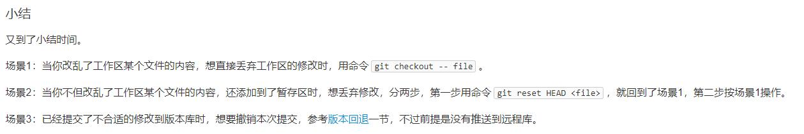

# gittest
a demo to practice how to use git

##trying to update something

one more try!

now i'm back in branch main

基本操作是这样的：

    "git add 文件名(. 表示add所有文件)"
    
    "git commit -m "a message to verify your commit."" #先add后提交
    
    "git log"#查看提交版本的历史记录，id号可用于回退历史版本
    
    "git reset --hard HEAD^"#表示回退上一版本（~num表示回退num个版本，也可以输入id，回退到指定版本）
    
    "git reflog"#用于记录每一次的命令，暂时没用到

小结附上一张图（摘自liaoxuefeng官网）：

##工作区和暂存区
先附上一张图

    "git status"#查看当前状态

所以add用于将所有修改放到暂存区，commit用于将这些修改提交到分支，push就是上远程了

提交后没做修改再看status那工作区就是干净的

##管理修改

**一句话核心：Git管理的是修改，而不是文件本身**

要记录修改的话一定要add暂存，暂存后才能提交

##撤销修改

尝试换个颜色

    git checkout -- filename#丢弃工作区的修改
    
我理解是不管提交与否，实际上就是回到了上一次commit或提交的状态

记住 -- 参数很重要，没有 -- ，checkout就是切换分支的命令

    git reset HEAD filename#可以撤销暂存区的修改（已经add但未commit），重新放回工作区
    
小结附图：

先分割一下

---